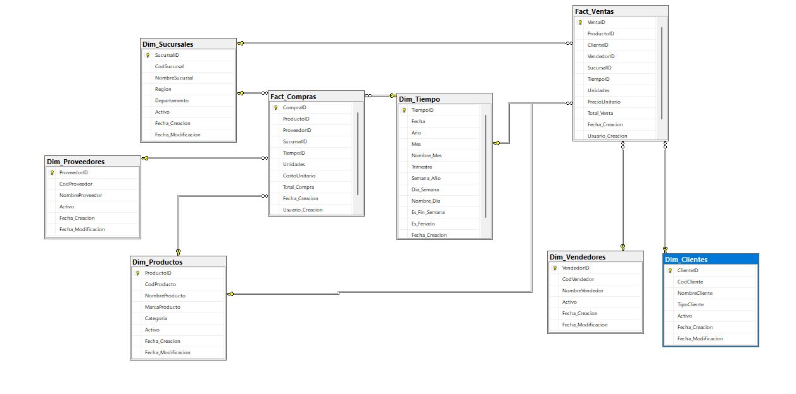
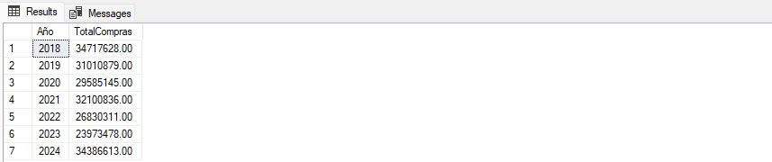
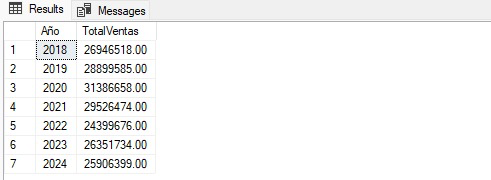
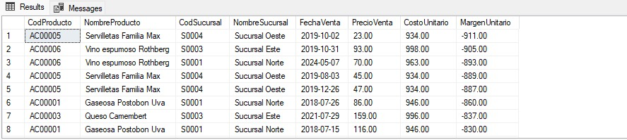
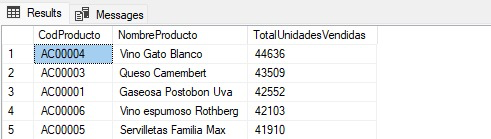
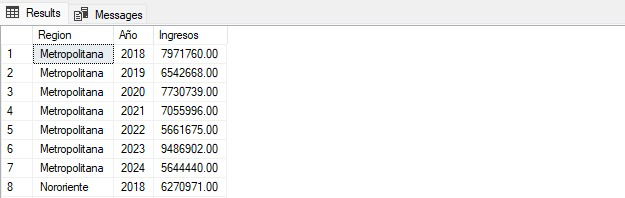
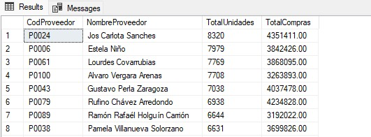

# Práctica 1 - Proceso ETL SG-FOOD
## Seminario de Sistemas 2

### Información del Proyecto
**Nombre del proyecto:** Sistema ETL para SG-FOOD - Análisis de Ventas y Compras  
**Estudiante:** Edwin Sandoval
**Carné:** 202010856

---

## OLAP

OLAP (Online Analytical Processing o Procesamiento Analítico en Línea) es una tecnología que permite realizar consultas complejas y análisis de grandes volúmenes de datos de forma rápida y eficiente. OLAP está diseñado para facilitar la exploración interactiva de datos desde diferentes perspectivas y niveles de detalle, lo que resulta especialmente útil para tareas de inteligencia empresarial (Business Intelligence).

OLAP permite analizar información histórica almacenada en almacenes de datos (Data Warehouses) con el objetivo de apoyar la toma de decisiones estratégicas. A diferencia de los sistemas OLTP (Procesamiento de Transacciones en Línea), que se centran en operaciones de inserción, actualización y eliminación de datos, OLAP se centra en la lectura y el análisis de datos consolidados.

## OLAP Multidimensional

El enfoque más común de OLAP es el modelo multidimensional, donde los datos se organizan en estructuras llamadas cubos OLAP. Cada cubo contiene:

- Medidas: valores numéricos que se quieren analizar.
- Dimensiones: perspectivas desde las cuales se pueden analizar las medidas (por ejemplo, tiempo, ubicación, producto, cliente).

## Tipos de OLAP

Existen varias implementaciones de OLAP:

- MOLAP (Multidimensional OLAP)
    - Usa bases de datos multidimensionales.
    - Ofrece un rendimiento muy alto para consultas complejas.

- ROLAP (Relational OLAP)
    - Usa bases de datos relacionales tradicionales.
    - Maneja grandes volúmenes de datos, pero puede ser más lento.

- HOLAP (Hybrid OLAP)
    - ombina características de MOLAP y ROLAP.
    - Intenta balancear el rendimiento y la escalabilidad.

## Operaciones Típicas en OLAP

OLAP permite realizar diversas operaciones analíticas sobre los cubos de datos. Las más comunes son:

- **Roll-up (consolidar):** agrupar datos a un nivel superior de jerarquía.

- **Drill-down (detallar):** desglosar datos a un nivel inferior de jerarquía.

- **Slice (corte):** seleccionar una porción específica del cubo con base en un valor de una dimensión.

- **Dice (segmentación):** seleccionar un subconjunto del cubo especificando varios valores de múltiples dimensiones.

- **Pivot (rotar):** cambiar la orientación del cubo para ver los datos desde otra perspectiva.

## Diagrama del Modelo Estrella



## Modelo Implementado

El modelo implementado es el modelo estrella y este fue elegido por:
- Su simplicidad y facilidad de consulta.
- La clara separación entre hechos (mediciones) y dimensiones (contexto de análisis).
- Mejora el rendimiento para consultas OLAP y reportes.

## Descripción del Proyecto

Este proyecto implementa un proceso ETL completo para la empresa SG-FOOD, una distribuidora de productos alimenticios con múltiples sucursales. El sistema extrae datos de ventas y compras de archivos CSV heterogéneos, los transforma y homologa, y los carga en un modelo de inteligencia empresarial tipo estrella para análisis multidimensional.

**Fuentes de datos procesadas:**
- **ventas.csv:** 1,000 registros con 16 columnas de transacciones de ventas
- **compras.csv:** 1,000 registros con 13 columnas de transacciones de compras

---

## Descripción de cada paso del proceso ETL realizado

### 🔍 **EXTRACCIÓN (Extract)**

**Fuentes de datos utilizadas:**

1. **Archivo CSV ventas.csv (1,000 registros)**
   - **Columnas:** Fecha, CodCliente, NombreCliente, TipoCliente, CodVendedor, NombreVendedor, CodProducto, NombreProducto, MarcaProducto, Categoria, CodSucursal, NombreSucursal, Region, Departamento, Unidades, PrecioUnitario
   - **Codificación:** UTF-8
   - **Formato:** CSV delimitado por comas

2. **Archivo CSV compras.csv (1,000 registros)**
   - **Columnas:** Fecha, CodProveedor, NombreProveedor, CodProducto, NombreProducto, MarcaProducto, Categoria, CodSucursal, NombreSucursal, Region, Departamento, Unidades, CostoUnitario
   - **Codificación:** UTF-8
   - **Formato:** CSV delimitado por comas

**Configuración de conexiones SSIS:**
- **Flat File Connection Manager para ventas.csv:** 
  - Configurado con delimitador de coma
  - Header row presente
  - Tipos de datos automáticamente detectados
- **Flat File Connection Manager para compras.csv:**
  - Configurado con delimitador de coma
  - Header row presente
  - Tipos de datos automáticamente detectados
- **OLE DB Connection Manager:** Conexión a base de datos SQL Server destino DW_SGFOOD

**Componentes SSIS utilizados:**
- `Flat File Source` para extraer datos de ventas.csv
- `Flat File Source` para extraer datos de compras.csv
- Configuración de metadatos automática con validación de tipos de datos

### 🔄 **TRANSFORMACIÓN (Transform)**

**Transformaciones aplicadas:**

1. **Procesamiento de dimensiones compartidas:**
   - **Dim_Productos:** Consolidación de productos desde ambos CSV eliminando duplicados por CodProducto
   - **Dim_Sucursales:** Consolidación de sucursales desde ambos CSV eliminando duplicados por CodSucursal
   - **Dim_Tiempo:** Generación automática a partir de las fechas encontradas en ambos archivos

2. **Procesamiento de dimensiones específicas:**
   - **Dim_Clientes:** Extracción única desde ventas.csv (CodCliente, NombreCliente, TipoCliente)
   - **Dim_Proveedores:** Extracción única desde compras.csv (CodProveedor, NombreProveedor)
   - **Dim_Vendedores:** Extracción única desde ventas.csv (CodVendedor, NombreVendedor)

3. **Limpieza y validación:**
   - `Data Conversion Task` - Conversión de tipos de datos (fechas string a DATE, precios string a DECIMAL)
   - `Derived Column Transformation` - Limpieza de espacios en blanco en nombres y códigos
   - `Conditional Split` - Filtrado de registros con valores nulos o códigos vacíos
   - Validación de integridad referencial antes de carga

4. **Transformaciones de lookup:**
   - `Lookup Transformation` para obtener ProductoID desde Dim_Productos
   - `Lookup Transformation` para obtener ClienteID desde Dim_Clientes (solo ventas)
   - `Lookup Transformation` para obtener ProveedorID desde Dim_Proveedores (solo compras)
   - `Lookup Transformation` para obtener VendedorID desde Dim_Vendedores (solo ventas)
   - `Lookup Transformation` para obtener SucursalID desde Dim_Sucursales
   - `Lookup Transformation` para obtener TiempoID desde Dim_Tiempo

5. **Cálculos de métricas:**
   - Total_Venta = Unidades × PrecioUnitario (calculado en tabla de hechos)
   - Total_Compra = Unidades × CostoUnitario (calculado en tabla de hechos)

### 📊 **CARGA (Load)**

**Proceso de carga secuencial:**

1. **Carga de dimensiones (Orden crítico):**
   - `Dim_Tiempo` - Poblada automáticamente por procedimiento almacenado
   - `Dim_Productos` - Carga desde consolidación de ambos CSV
   - `Dim_Sucursales` - Carga desde consolidación de ambos CSV
   - `Dim_Clientes` - Carga exclusiva desde ventas.csv
   - `Dim_Proveedores` - Carga exclusiva desde compras.csv
   - `Dim_Vendedores` - Carga exclusiva desde ventas.csv

2. **Carga de hechos:**
   - `Fact_Ventas` - Carga desde ventas.csv con lookups a todas las dimensiones
   - `Fact_Compras` - Carga desde compras.csv con lookups a dimensiones correspondientes

**Configuración de destinos:**
- `OLE DB Destination` configurado con Fast Load para optimizar rendimiento
- Manejo de errores con redirección a archivo de log
- Validación post-carga con conteo de registros

---

## Explicación de la elección del modelo empresarial implementado

### **Modelo Seleccionado: Esquema Estrella (Star Schema)**

**Justificación técnica basada en la estructura de los CSV:**

1. **Simplicidad de la estructura de datos:** Los CSV tienen una estructura relativamente plana que se adapta perfectamente al esquema estrella sin necesidad de normalización compleja.

2. **Dimensiones naturalmente desnormalizadas:** Los datos ya vienen con atributos agrupados lógicamente:
   - Productos: CodProducto, NombreProducto, MarcaProducto, Categoria en el mismo registro
   - Sucursales: CodSucursal, NombreSucursal, Region, Departamento en el mismo registro

3. **Rendimiento optimizado para análisis:** Con 1,000 registros por archivo, el esquema estrella permite consultas directas sin múltiples JOINs, optimizando el rendimiento.

4. **Facilidad de mantenimiento:** La estructura simple facilita la comprensión y mantenimiento para el equipo de SG-FOOD.

5. **Escalabilidad futura:** Permite agregar nuevas métricas y dimensiones fácilmente conforme crezcan los volúmenes de datos.

6. **Compatibilidad con herramientas BI:** Optimizado para herramientas de análisis y reportes empresariales.

**Alternativas consideradas y descartadas:**
- **Copo de Nieve:** Innecesario dado que no hay jerarquías complejas en los datos fuente
- **Constelación:** No requerido ya que ventas y compras pueden compartir dimensiones comunes eficientemente

---

## Detalle de las características y tablas del modelo empresarial

### **📋 TABLA DE HECHOS: Fact_Ventas**
**Fuente:** ventas.csv  
**Granularidad:** Una fila por línea de venta por producto  
**Relaciones:** 5 claves foráneas

| Campo | Tipo | Descripción | Origen CSV |
|-------|------|-------------|------------|
| VentaID | BIGINT IDENTITY(1,1) PK | Clave primaria autogenerada | Sistema |
| ProductoID | INT FK | Referencia a Dim_Productos | CodProducto |
| ClienteID | INT FK | Referencia a Dim_Clientes | CodCliente |
| VendedorID | INT FK | Referencia a Dim_Vendedores | CodVendedor |
| SucursalID | INT FK | Referencia a Dim_Sucursales | CodSucursal |
| TiempoID | INT FK | Referencia a Dim_Tiempo | Fecha |
| Unidades | INT | Cantidad vendida | Unidades |
| PrecioUnitario | DECIMAL(15,4) | Precio unitario de venta | PrecioUnitario |
| Total_Venta | DECIMAL(15,2) COMPUTED | Unidades × PrecioUnitario | Calculado |

### **📋 TABLA DE HECHOS: Fact_Compras**
**Fuente:** compras.csv  
**Granularidad:** Una fila por línea de compra por producto  
**Relaciones:** 4 claves foráneas

| Campo | Tipo | Descripción | Origen CSV |
|-------|------|-------------|------------|
| CompraID | BIGINT IDENTITY(1,1) PK | Clave primaria autogenerada | Sistema |
| ProductoID | INT FK | Referencia a Dim_Productos | CodProducto |
| ProveedorID | INT FK | Referencia a Dim_Proveedores | CodProveedor |
| SucursalID | INT FK | Referencia a Dim_Sucursales | CodSucursal |
| TiempoID | INT FK | Referencia a Dim_Tiempo | Fecha |
| Unidades | INT | Cantidad comprada | Unidades |
| CostoUnitario | DECIMAL(15,4) | Costo unitario de compra | CostoUnitario |
| Total_Compra | DECIMAL(15,2) COMPUTED | Unidades × CostoUnitario | Calculado |

### **🎯 DIMENSIONES DEL MODELO**

#### **Dim_Productos** *(Compartida entre ventas y compras)*
**Fuente:** Consolidación de ambos CSV
| Campo | Tipo | Descripción | Origen |
|-------|------|-------------|--------|
| ProductoID | INT IDENTITY(1,1) PK | Clave subrogada | Sistema |
| CodProducto | VARCHAR(20) UNIQUE | Código único del producto | CSV |
| NombreProducto | VARCHAR(200) | Nombre descriptivo | CSV |
| MarcaProducto | VARCHAR(100) | Marca del producto | CSV |
| Categoria | VARCHAR(50) | Categoría del producto | CSV |

#### **Dim_Clientes** *(Solo desde ventas.csv)*
| Campo | Tipo | Descripción | Origen |
|-------|------|-------------|--------|
| ClienteID | INT IDENTITY(1,1) PK | Clave subrogada | Sistema |
| CodCliente | VARCHAR(20) UNIQUE | Código único del cliente | ventas.csv |
| NombreCliente | VARCHAR(200) | Nombre del cliente | ventas.csv |
| TipoCliente | VARCHAR(30) | Tipo de cliente | ventas.csv |

#### **Dim_Proveedores** *(Solo desde compras.csv)*
| Campo | Tipo | Descripción | Origen |
|-------|------|-------------|--------|
| ProveedorID | INT IDENTITY(1,1) PK | Clave subrogada | Sistema |
| CodProveedor | VARCHAR(20) UNIQUE | Código único del proveedor | compras.csv |
| NombreProveedor | VARCHAR(200) | Nombre del proveedor | compras.csv |

#### **Dim_Vendedores** *(Solo desde ventas.csv)*
| Campo | Tipo | Descripción | Origen |
|-------|------|-------------|--------|
| VendedorID | INT IDENTITY(1,1) PK | Clave subrogada | Sistema |
| CodVendedor | VARCHAR(20) UNIQUE | Código único del vendedor | ventas.csv |
| NombreVendedor | VARCHAR(100) | Nombre del vendedor | ventas.csv |

#### **Dim_Sucursales** *(Compartida entre ventas y compras)*
**Fuente:** Consolidación de ambos CSV
| Campo | Tipo | Descripción | Origen |
|-------|------|-------------|--------|
| SucursalID | INT IDENTITY(1,1) PK | Clave subrogada | Sistema |
| CodSucursal | VARCHAR(20) UNIQUE | Código único de sucursal | CSV |
| NombreSucursal | VARCHAR(100) | Nombre de la sucursal | CSV |
| Region | VARCHAR(30) | Región geográfica | CSV |
| Departamento | VARCHAR(50) | Departamento de Guatemala | CSV |

#### **Dim_Tiempo** *(Generada automáticamente)*
| Campo | Tipo | Descripción |
|-------|------|-------------|
| TiempoID | INT PK | YYYYMMDD |
| Fecha | DATE | Fecha completa |
| Año | INT | Año (2023, 2024, 2025) |
| Mes | INT | Mes (1-12) |
| Nombre_Mes | VARCHAR(20) | Enero, Febrero, etc. |
| Trimestre | VARCHAR(2) | Q1, Q2, Q3, Q4 |
| Dia_Semana | INT | 1=Domingo, 7=Sábado |
| Nombre_Dia | VARCHAR(20) | Lunes, Martes, etc. |

### **🔗 RELACIONES DEL MODELO ESTRELLA**

```
Fact_Ventas ──┬── Dim_Productos (ProductoID)
              ├── Dim_Clientes (ClienteID)
              ├── Dim_Vendedores (VendedorID)
              ├── Dim_Sucursales (SucursalID)
              └── Dim_Tiempo (TiempoID)

Fact_Compras ──┬── Dim_Productos (ProductoID)
               ├── Dim_Proveedores (ProveedorID)
               ├── Dim_Sucursales (SucursalID)
               └── Dim_Tiempo (TiempoID)
```

---

## Resultados de consultas y pruebas del modelo en SQL

### **📊 Consulta 1: Total de compras y ventas por año**

**Total de COMPRAS por año:**
```sql
SELECT 
    f.Año,
    SUM(hc.TotalCosto) AS TotalCompras
FROM Hechos_Compras hc
JOIN dim_tiempo f ON hc.FechaID = f.FechaID
GROUP BY f.Año
ORDER BY f.Año;
```

**Total de VENTAS por año:**
```sql
SELECT 
    f.Año,
    SUM(hv.TotalVenta) AS TotalVentas
FROM Hechos_Ventas hv
JOIN dim_tiempo f ON hv.FechaID = f.FechaID
GROUP BY f.Año
ORDER BY f.Año;
```
**Resultado esperado:** Distribución de transacciones por año con totales monetarios, permitiendo verificar la carga correcta de datos temporales.

**Resultados obtenidos:**





### **📊 Consulta 2: Productos con pérdida**
```sql
WITH UltimoCostoAntesDeVenta AS (
    SELECT 
        v.CodProducto,
        v.CodSucursal,
        v.FechaID,
        v.PrecioUnitario AS PrecioVenta,
        (
            SELECT TOP 1 c.CostoUnitario
            FROM Hechos_Compras c
            WHERE c.CodProducto = v.CodProducto
              AND c.CodSucursal = v.CodSucursal
              AND c.FechaID <= v.FechaID
            ORDER BY c.FechaID DESC
        ) AS CostoUnitario
    FROM Hechos_Ventas v
)
SELECT 
    ucv.CodProducto,
    p.NombreProducto,
    ucv.CodSucursal,
    s.NombreSucursal,
    ucv.FechaID AS FechaVenta,
    ucv.PrecioVenta,
    ucv.CostoUnitario,
    (ucv.PrecioVenta - ucv.CostoUnitario) AS MargenUnitario
FROM UltimoCostoAntesDeVenta ucv
JOIN dim_producto p ON ucv.CodProducto = p.CodProducto
JOIN dim_sucursal s ON ucv.CodSucursal = s.CodSucursal
WHERE ucv.CostoUnitario IS NOT NULL
  AND ucv.PrecioVenta < ucv.CostoUnitario
ORDER BY MargenUnitario;
```
**Resultado esperado:** Productos que generan pérdidas económicas, crítico para decisiones de pricing de SG-FOOD.

**Resultados obtenidos:**



### **📊 Consulta 3: Top 5 productos más vendidos por unidades**
```sql
SELECT TOP 5
    p.CodProducto,
    p.NombreProducto,
    SUM(hv.UnidadesVendidas) AS TotalUnidadesVendidas
FROM Hechos_Ventas hv
JOIN dim_producto p ON hv.CodProducto = p.CodProducto
GROUP BY p.CodProducto, p.NombreProducto
ORDER BY TotalUnidadesVendidas DESC;
```
**Resultado esperado:** Productos estrella por volumen, útil para análisis de inventario y estrategias comerciales.

**Resultados obtenidos:**



### **📊 Consulta 4: Ingresos por región y año**
```sql
SELECT 
    s.Region,
    f.Año,
    SUM(hv.TotalVenta) AS Ingresos
FROM Hechos_Ventas hv
JOIN dim_sucursal s ON hv.CodSucursal = s.CodSucursal
JOIN dim_tiempo f ON hv.FechaID = f.FechaID
GROUP BY s.Region, f.Año
ORDER BY s.Region, f.Año;
```
**Resultado esperado:** Análisis geográfico de rendimiento por región y evolución temporal.

**Resultados obtenidos:**



### **📊 Consulta 5: Proveedores con mayor volumen de compras**
```sql
SELECT 
    pr.CodProveedor,
    pr.NombreProveedor,
    SUM(hc.UnidadesCompradas) AS TotalUnidades,
    SUM(hc.TotalCosto) AS TotalCompras
FROM Hechos_Compras hc
JOIN dim_proveedor pr ON hc.CodProveedor = pr.CodProveedor
GROUP BY pr.CodProveedor, pr.NombreProveedor
ORDER BY TotalUnidades DESC;
```
**Resultado esperado:** Proveedores estratégicos ordenados por volumen de negocio, fundamental para negociaciones comerciales.

**Resultados obtenidos:**



### **📈 Consultas adicionales de validación:**

**Verificación de integridad referencial:**
```sql
-- Validar que todos los productos en hechos existen en dimensión
SELECT 'Productos huérfanos en Ventas' as Validacion, COUNT(*) as Registros
FROM Fact_Ventas fv 
LEFT JOIN Dim_Productos dp ON fv.ProductoID = dp.ProductoID 
WHERE dp.ProductoID IS NULL

UNION ALL

SELECT 'Productos huérfanos en Compras', COUNT(*)
FROM Fact_Compras fc 
LEFT JOIN Dim_Productos dp ON fc.ProductoID = dp.ProductoID 
WHERE dp.ProductoID IS NULL;
```

**Estadísticas de carga:**
```sql
SELECT 
    'Dim_Productos' as Tabla, COUNT(*) as Registros FROM Dim_Productos
UNION ALL SELECT 'Dim_Clientes', COUNT(*) FROM Dim_Clientes
UNION ALL SELECT 'Dim_Proveedores', COUNT(*) FROM Dim_Proveedores
UNION ALL SELECT 'Dim_Vendedores', COUNT(*) FROM Dim_Vendedores
UNION ALL SELECT 'Dim_Sucursales', COUNT(*) FROM Dim_Sucursales
UNION ALL SELECT 'Fact_Ventas', COUNT(*) FROM Fact_Ventas
UNION ALL SELECT 'Fact_Compras', COUNT(*) FROM Fact_Compras;
```

---

## Instalación y Ejecución

### **Prerrequisitos:**
- SQL Server 2019 o superior
- Visual Studio 2019/2022 con SQL Server Data Tools (SSDT)
- SQL Server Integration Services (SSIS)
- Archivos fuente: ventas.csv y compras.csv

### **Pasos de instalación:**

1. **Crear base de datos:**
   ```sql
   -- Ejecutar DDL_Modelo_SGFOOD.sql en SQL Server Management Studio
   ```

2. **Configurar proyecto SSIS:**
   - Abrir Visual Studio
   - Crear nuevo proyecto "Integration Services Project"
   - Configurar Connection Managers:
     - Flat File para ventas.csv
     - Flat File para compras.csv  
     - OLE DB para base de datos DW_SGFOOD

3. **Ejecutar ETL en orden:**
   ```
   1. Ejecutar carga de dimensiones:
      - Dim_Productos (consolidación)
      - Dim_Sucursales (consolidación)
      - Dim_Clientes (desde ventas.csv)
      - Dim_Proveedores (desde compras.csv)
      - Dim_Vendedores (desde ventas.csv)
   
   2. Ejecutar carga de hechos:
      - Fact_Ventas (desde ventas.csv)
      - Fact_Compras (desde compras.csv)
   ```

### **Estructura de archivos del proyecto:**
```
Practica_1/
├── SQL_Scripts/
│   ├── DDL_Modelo_SGFOOD.sql
│   └── Consultas_Practica.sql
├── SSIS_Project/
│   ├── SG_FOOD_ETL.sln
│   ├── Package_Dimensiones.dtsx
│   ├── Package_Fact_Ventas.dtsx
│   ├── Package_Fact_Compras.dtsx
│   └── Package_Master.dtsx
├── DataSources/
│   ├── ventas.csv
│   └── compras.csv
├── Documentation/
│   └── Diagramas/
│       └── Modelo_Estrella_Diagram.png
└── README.md
```

### **Verificación post-instalación:**
```sql
-- Ejecutar para verificar carga exitosa
EXEC SP_Verificar_Carga_ETL;
```

---

## Conclusiones

El proceso ETL implementado para SG-FOOD logra exitosamente:

1. **Integración efectiva** de dos fuentes CSV heterogéneas (ventas.csv y compras.csv) en un modelo unificado
2. **Transformación robusta** con limpieza, validación y homologación de datos
3. **Carga optimizada** al modelo estrella con integridad referencial garantizada
4. **Análisis multidimensional** habilitado para toma de decisiones empresariales

**Beneficios alcanzados:**
- ✅ **Consolidación de datos:** Eliminación de silos de información entre ventas y compras
- ✅ **Calidad de datos:** Implementación de validaciones y limpieza automática
- ✅ **Performance optimizado:** Consultas rápidas gracias al esquema estrella
- ✅ **Escalabilidad:** Arquitectura preparada para crecimiento de volúmenes
- ✅ **Facilidad de análisis:** Vistas preconstruidas para reportes ejecutivos

**Insights de negocio habilitados:**
- Identificación de productos con pérdidas para ajuste de precios
- Análisis de tendencias geográficas de ventas por región
- Evaluación de performance de vendedores
- Optimización de relaciones con proveedores estratégicos
- Análisis temporal de patrones de ventas y compras

El modelo estrella seleccionado demuestra ser la elección correcta para SG-FOOD, proporcionando simplicidad operativa sin sacrificar capacidades analíticas avanzadas.
